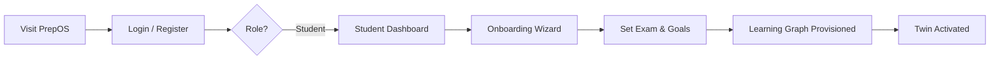
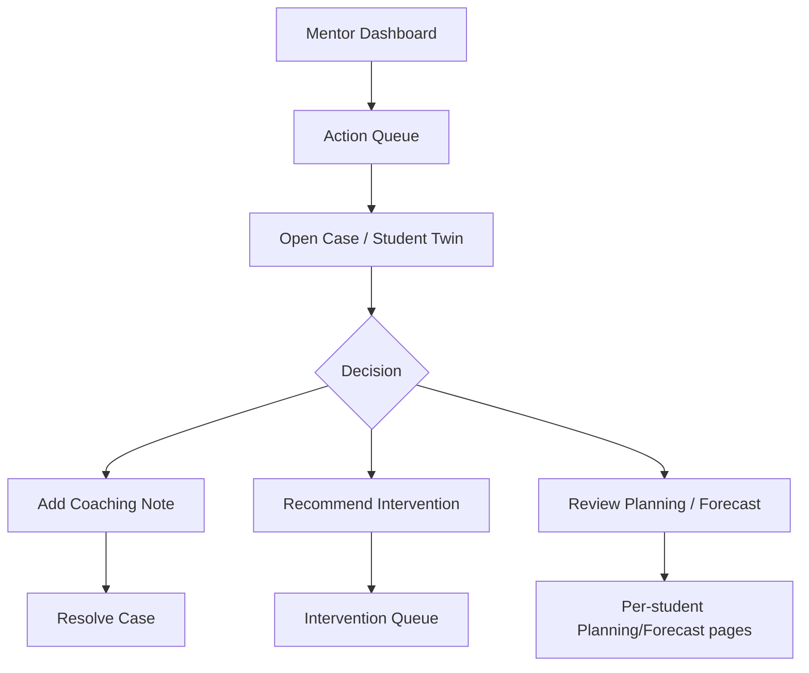
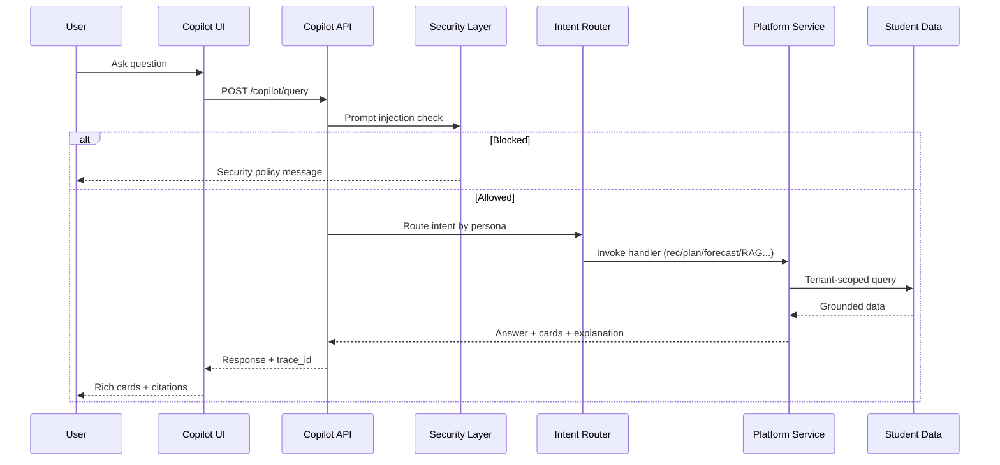
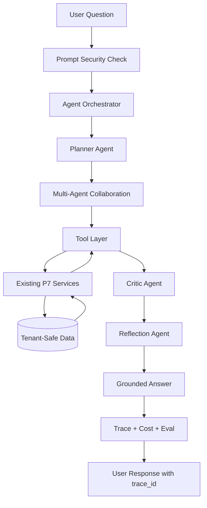
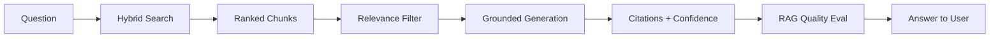
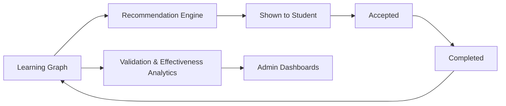
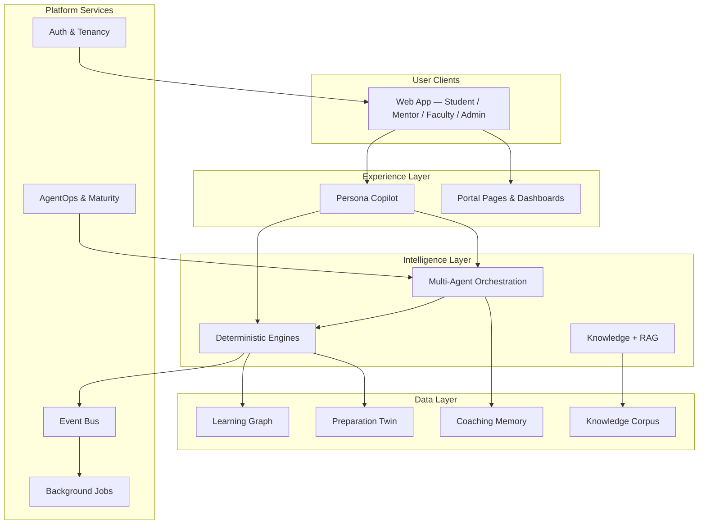

# PrepOS AI — Product Experience Guide & User Journey Handbook

**Version:** 1.0  
**Scope:** Platform capabilities from Phase 1 (P1) through Phase 11 (P11)  
**Audience:** Product Managers · Business Stakeholders · New Developers · QA Engineers · Sales Teams · Client Institutions · Investors · End Users  
**Document type:** Master onboarding, demonstration, stakeholder review, and customer presentation handbook  

---

> **How to use this guide**  
> This document explains PrepOS from the **user’s perspective**. It describes what people see, what they can do, and what outcomes the platform delivers. It intentionally avoids implementation details, code, and internal engineering jargon unless defined in the Appendix.

---

## Table of Contents

1. [Executive Summary](#1-executive-summary)  
2. [Platform Vision](#2-platform-vision)  
3. [User Personas](#3-user-personas)  
4. [End-to-End User Journeys](#4-end-to-end-user-journeys)  
5. [Complete Navigation Tree](#5-complete-navigation-tree)  
6. [Screen-by-Screen Feature Catalog](#6-screen-by-screen-feature-catalog)  
7. [AI Capability Guide](#7-ai-capability-guide)  
8. [AI User Flows](#8-ai-user-flows)  
9. [Feature Access Matrix](#9-feature-access-matrix)  
10. [Analytics & Reporting Catalog](#10-analytics--reporting-catalog)  
11. [Admin Operations Guide](#11-admin-operations-guide)  
12. [Governance & Security Features](#12-governance--security-features)  
13. [Platform Architecture Overview](#13-platform-architecture-overview)  
14. [Complete Capability Inventory](#14-complete-capability-inventory)  
15. [Appendix](#15-appendix)  

---

## 1. Executive Summary

**PrepOS AI** is an AI-native Civil Services Preparation Operating System built for UPSC, APPSC, TSPSC, and similar competitive exam ecosystems. It serves **aspirants**, **mentors**, **faculty**, **coaching institutes**, and **platform operators** in a single multi-tenant product.

Unlike content libraries or generic chatbots, PrepOS is **decision-intelligence first**. The platform continuously answers four questions for every learner:

| Question | PrepOS Answer |
|----------|---------------|
| What should I study next? | Personalized recommendations grounded in mastery gaps and exam weight |
| What should I revise? | Spaced revision queue driven by retention decay |
| Am I improving? | Readiness score, twin forecast, and learning timeline |
| Why am I not improving? | Weakness analysis, intervention signals, and explainable AI guidance |

### What the platform delivers (P1–P11)

| Phase | Theme | User-visible outcome |
|-------|-------|----------------------|
| **P1** | Foundation & Twin | Login, onboarding, learning graph, preparation twin, study plan, goals, mentor workspace |
| **P2–P6** | Deterministic engines | Scoring, revision, assessment, mentor cases, analytics foundations |
| **P7** | Knowledge & RAG | Grounded Q&A, PYQ intelligence, current affairs, RAG quality monitoring |
| **P8** | Agent orchestration | Multi-step AI that plans and invokes tools instead of single-shot answers |
| **P9** | Agentic platform | Multi-agent collaboration, critique, reflection, marketplace, autonomous workflows |
| **P10** | AgentOps | Trace explorer, cost intelligence, approvals, benchmarks, prompt registry |
| **P11** | Production maturity | Security hardening, tenant audit, validation engines, rich copilot UX, platform readiness |

### One-sentence positioning

**PrepOS tells every aspirant what matters, what does not matter, and what to do next — with evidence, not guesswork.**

---

## 2. Platform Vision

### Mission

Help every aspirant know **what to study**, **what to revise**, **why they are improving**, and **why they are not improving** — without manual planning overhead.

### Vision pillars

| Pillar | Description |
|--------|-------------|
| **Learning Intelligence** | Per-concept mastery, retention, confidence, and readiness on a living learning graph |
| **Assessment Intelligence** | Activity ingestion (study, revision, assessment, PYQ) that updates the twin in near real time |
| **Revision Intelligence** | Priority-ranked revision queue based on decay and exam importance |
| **Mentor Intelligence** | Case queue, interventions, cohort signals, and coaching memory |
| **Institutional Intelligence** | Segment health, ROI, initiative effectiveness, and executive dashboards |

### Product philosophy

```
Traditional platforms  →  Content first
AI chatbots            →  Information first
PrepOS AI              →  Decision intelligence first
```

### Core product objects (user-facing concepts)

| Concept | What the user experiences |
|---------|---------------------------|
| **Learning Graph** | A map of syllabus concepts with mastery, retention, and weakness signals |
| **Preparation Twin** | A live digital mirror of the student’s exam readiness |
| **Study Plan** | Actionable daily/weekly tasks tied to readiness gain |
| **Revision Queue** | Concepts due for revision, ranked by urgency |
| **Goal & Forecast** | Target readiness with probability and what-if scenarios |
| **Copilot** | Persona-aware AI assistant available on every portal |
| **Coaching Memory** | Durable context so AI remembers progress across sessions |

---

## 3. User Personas

### 3.1 Student (Aspirant)

**Who:** UPSC/APPSC/TSPSC aspirant — self-study or coaching-attached.

**Goals:** Crack the exam, stay consistent, revise effectively, understand weak areas.

**Primary portal:** Student Portal (`/student/*`)

**Typical day:** Check dashboard → log activity → follow recommendations → revise due concepts → ask Copilot → review forecast.

---

### 3.2 Mentor

**Who:** Assigned coach or senior aspirant guide within an institute.

**Goals:** Prioritize at-risk students, recommend interventions, track case outcomes.

**Primary portal:** Mentor Portal (`/mentor/*`)

**Typical day:** Review dashboard → work action queue → open student twin → add case notes → trigger interventions → ask Mentor Copilot.

---

### 3.3 Faculty

**Who:** Classroom teacher or subject expert at a coaching institute.

**Goals:** Design teaching plans, identify weak concepts across batches, align instruction with PYQ trends and current affairs.

**Primary portal:** Faculty Workspace (`/faculty`) — uses mentor-grade access with teaching-focused aggregation.

**Typical day:** Open faculty workspace → review cohort weak concepts → align weekly teaching → reference PYQ trends → consult Copilot for batch insights.

---

### 3.4 Institute Admin

**Who:** Head of academics, center director, or operations lead at a coaching institute.

**Goals:** Monitor platform health, knowledge quality, AI adoption, cohort performance, and institutional ROI.

**Primary portal:** Admin dashboards (`/admin/*`) + Mentor Portal for day-to-day coaching oversight.

**Typical day:** Check platform health → review copilot analytics → upload knowledge → monitor RAG quality → review cohort and institution dashboards → approve agent actions.

---

### 3.5 Super Admin

**Who:** PrepOS platform operator or enterprise deployment owner.

**Goals:** Cross-tenant operations, catalog management, disaster recovery, security posture, platform readiness.

**Primary portal:** All admin dashboards; backend catalog operations (often via operational tools).

**Typical day:** Security review → tenant audit → monitoring → backup verification → platform readiness score → syllabus/catalog governance.

---

## 4. End-to-End User Journeys

### 4.1 Student Journey

#### First login



| Step | Experience | Outcome |
|------|------------|---------|
| 1. Authentication | Sign in at `/login` | Secure session; tenant isolation |
| 2. Onboarding | `/student/onboarding` — exam selection, goal setting | Profile and preparation goal created |
| 3. First dashboard | `/student/dashboard` | Readiness snapshot, twin KPIs, recommended next actions |
| 4. Copilot introduction | Floating Copilot launcher (bottom-left) | Suggested prompts: *What should I study next?*, *Show my goal forecast* |

#### Dashboard experience

The student dashboard is the **command center**:

- Current readiness score and trend
- Twin forecast summary
- Quick links to recommendations, revision queue, and study plan
- Copilot always available for natural-language queries

#### Daily workflow

| Time | Action | Screen | AI involvement |
|------|--------|--------|----------------|
| Morning | Check plan & recommendations | Study Plan, Recommendations | Copilot: *What is my plan for today?* |
| Study block | Log study session | Log Activity | Twin updates via learning graph |
| Mid-day | Ask concept questions | Copilot | Knowledge RAG with citations |
| Afternoon | Complete revision items | Revision Queue | Revision engine prioritization |
| Evening | Review progress | Learning Graph, Timeline | Memory + forecast reflection |
| Weekly | Adjust goals & scenarios | Goals, Goal Forecasting | Forecasting engine what-if |

#### AI interactions

Students interact with **Student Copilot** on any `/student/*` page:

- **Deterministic mode (default):** Fast, intent-routed answers from verified platform data
- **Agent mode (advanced/backend):** Multi-step orchestration with planner, tools, and traceable execution

Example questions students ask:

- *What should I study next?*
- *Explain Federalism with citations*
- *Show PYQ trends for Polity*
- *How far am I from my goal?*
- *What milestones have I achieved?*

#### Reports & analytics (student-facing)

| View | Purpose |
|------|---------|
| Learning Graph | Concept-level mastery and weaknesses |
| Recommendations | Ranked next actions with impact scores |
| Revision Queue | Due concepts with priority |
| Study Plan | Daily/weekly execution tracker |
| Goal Forecasting | Probability of hitting target readiness |
| Learning Timeline | Chronological journey of progress events |

#### Outcomes

- Measurable readiness improvement over time
- Higher revision completion rates
- Reduced planning paralysis
- Explainable AI guidance the student can trust

---

### 4.2 Mentor Journey

#### First login

Mentors land on `/mentor/dashboard` after authentication (faculty, institute admin, and super admin roles also route here by default).

#### Dashboard experience

- Case load summary
- Recommended next mentor action
- Effectiveness metrics (when cases are resolved)
- Links to queue and interventions

#### Daily workflow



| Step | Screen | Purpose |
|------|--------|---------|
| Triage | `/mentor/queue` | Priority-ordered mentor actions |
| Deep dive | `/mentor/student/[studentId]` | Full twin and progress view |
| Intervene | `/mentor/interventions` | Risk/impact-ranked intervention queue |
| Cohort view | `/mentor/cohort` | Segment risks and trends |
| Case work | `/mentor/cases/[id]` | Notes, resolution, audit trail |

#### AI interactions

**Mentor Copilot** suggested prompts:

- *What should this student focus on?*
- *Show recommended interventions*
- *Which students are at risk?*
- *Summarize this student*

Copilot can pull student context when a student is selected, producing mentor-safe, tenant-isolated answers.

#### Reports & analytics

- Mentor dashboard effectiveness
- Per-student planning and forecasting drill-downs
- Cohort intelligence summaries via Copilot

#### Outcomes

- Faster identification of at-risk students
- Documented coaching decisions (cases + memory)
- Improved intervention success rates
- Evidence-based mentor performance tracking

---

### 4.3 Faculty Journey

#### First login

Faculty authenticate like mentors and access `/faculty` for teaching-oriented insights (not listed in mentor sidebar — direct navigation or bookmark).

#### Dashboard experience

Faculty workspace aggregates:

- **Teaching plans** — adaptive plans derived from cohort weak concepts
- **Weak concept analysis** — concepts needing classroom reinforcement
- **PYQ trends** — historical question patterns by subject/topic
- **Current affairs coverage** — link to institutional CA operations
- **Cohort teaching insights** — segment-level performance signals

#### Daily workflow

| Activity | How faculty uses PrepOS |
|----------|-------------------------|
| Weekly planning | Review weak concepts → align lecture sequence |
| Test design | Reference PYQ trends for emphasis areas |
| Batch review | Cohort insights for section-level adjustments |
| AI assist | Copilot (mentor persona) for batch-level questions |

#### AI interactions

Faculty benefit from the **Faculty Teaching Agent** capability (orchestrated access to cohort, forecasting, recommendation, PYQ, and current affairs tools) through Copilot and the faculty workspace API.

#### Outcomes

- Teaching aligned to actual student weakness data
- Better PYQ and current affairs coverage in classroom
- Reduced manual batch analysis time

---

### 4.4 Institute Admin Journey

#### First login

Institute admins register via `/register` (creates tenant + admin user) or are provisioned by operators. Default landing: `/mentor/dashboard` with full admin dashboard access.

#### Dashboard experience

Admin uses a **constellation of specialized dashboards** (no single admin sidebar — hub-and-spoke navigation via page headers):

**Operational hubs:**

| Hub | Entry point |
|-----|-------------|
| Platform health | `/admin/health` |
| Copilot adoption | `/admin/copilot` |
| Knowledge & RAG | `/admin/knowledge`, `/admin/rag-quality` |
| Content ops | `/admin/pyq`, `/admin/current-affairs` |
| Intelligence | `/admin/recommendations`, `/admin/planning`, `/admin/forecasting` |
| People & cohorts | `/admin/cohort`, `/admin/interventions`, `/admin/memory` |
| Institution | `/admin/institution`, `/admin/institution/outcomes` |
| Agents | `/admin/agents`, `/admin/agent-traces`, `/admin/approvals` |
| Maturity | `/admin/security`, `/admin/platform-readiness` |

#### Daily workflow

| Priority | Task | Dashboard |
|----------|------|-----------|
| P0 | Confirm platform is healthy | Platform Health |
| P1 | Upload/monitor knowledge sources | Knowledge Operations |
| P1 | Review copilot usage & intents | Copilot Analytics |
| P2 | Check RAG quality metrics | RAG Quality |
| P2 | Review cohort risk segments | Cohort Intelligence |
| P3 | Approve autonomous agent proposals | Agent Approvals |
| Weekly | Institution ROI & outcomes | Institution Outcomes |
| Monthly | Platform readiness score | Platform Readiness |

#### AI interactions

**Admin Copilot** suggested prompts:

- *Platform health*
- *Institution health*
- *Segment distribution*
- *Intervention summary*

Plus 90+ backend intents for operational queries.

#### Outcomes

- Institute-wide visibility into learning and AI performance
- Controlled knowledge corpus for grounded answers
- Measurable ROI on recommendations, plans, and interventions
- Governance over autonomous AI actions

---

### 4.5 Super Admin Journey

Super admins inherit all institute admin capabilities plus operational bypass for role checks on backend endpoints.

#### Additional responsibilities

| Area | Activity |
|------|----------|
| Catalog | Syllabus import, exam catalog publish |
| Security | Tenant isolation audit, prompt injection monitoring |
| Reliability | Disaster recovery verification, job queue health |
| AI quality | Agent benchmarks, trace export, cost caps |
| Business | Cross-tenant adoption analytics (when enabled) |

#### Outcomes

- Enterprise-grade operational confidence
- Audit-ready security and tenant isolation evidence
- Platform readiness score for investor and client reviews

---

## 5. Complete Navigation Tree

### 5.1 Global (all authenticated users)

```
PrepOS
├── /                          → Role-based redirect
├── /login                     → Sign in
├── /register                  → Create institute + admin account
├── /unauthorized              → Access denied
└── [Copilot Launcher]         → Floating on all portal pages (persona-aware)
```

### 5.2 Student Portal

```
Student Portal (/student)
├── Dashboard                  /student/dashboard
├── Log Activity               /student/activities
├── Learning Graph             /student/learning-graph
├── Recommendations            /student/recommendations
├── Revision Queue             /student/revision-queue
├── Study Plan                 /student/study-plan
├── Adaptive Planning          /student/planning
├── Goal Forecasting           /student/forecasting
├── Goals                      /student/goals
├── Twin Forecast              /student/forecast
├── Learning Timeline          /student/timeline
└── Onboarding (wizard)        /student/onboarding
```

### 5.3 Mentor Portal

```
Mentor Portal (/mentor)
├── Dashboard                  /mentor/dashboard
├── Queue                      /mentor/queue
├── Interventions              /mentor/interventions
├── Cohort                     /mentor/cohort
├── Student Twin (detail)      /mentor/student/[studentId]
├── Case Workspace             /mentor/cases/[id]
└── Per-student drill-downs
    ├── Planning               /mentor/students/[id]/planning
    ├── Forecasting            /mentor/students/[id]/forecasting
    └── Interventions          /mentor/students/[id]/interventions
```

### 5.4 Faculty Portal

```
Faculty Workspace (/faculty)
└── Teaching Workspace         /faculty
    (weak concepts, PYQ trends, cohort insights, teaching plans)
```

### 5.5 Admin Portal

```
Admin Dashboards (/admin) — accessed via direct URLs & cross-links
├── Operations
│   ├── Platform Health        /admin/health
│   ├── Copilot Analytics      /admin/copilot
│   ├── Knowledge Operations   /admin/knowledge
│   │   └── Source Detail      /admin/knowledge/[id]
│   ├── RAG Quality            /admin/rag-quality
│   ├── PYQ Intelligence       /admin/pyq
│   └── Current Affairs        /admin/current-affairs
│       └── Article Detail     /admin/current-affairs/[id]
├── Learning Intelligence
│   ├── Recommendations        /admin/recommendations
│   ├── Rec. Effectiveness     /admin/recommendation-effectiveness
│   ├── Coaching Memory        /admin/memory
│   ├── Adaptive Planning      /admin/planning
│   ├── Goal Forecasting       /admin/forecasting
│   └── Interventions          /admin/interventions
├── Institution
│   ├── Institution Intel      /admin/institution
│   └── Outcomes & ROI         /admin/institution/outcomes
│   └── Cohort Intelligence    /admin/cohort
├── Agent Platform
│   ├── Agent Orchestration    /admin/agents
│   ├── Agent Health           /admin/agents/health
│   ├── Trace Explorer         /admin/agent-traces
│   ├── Cost Intelligence      /admin/agent-costs
│   └── Approval Workflows     /admin/approvals
└── Platform Maturity (P11)
    ├── Security Hardening     /admin/security
    └── Platform Readiness     /admin/platform-readiness
```

**Note:** Several P11 admin capabilities (jobs, evaluations, forecast accuracy, monitoring, adoption, outcomes, rate limits, tenant audit UI) are available via API and are being surfaced in the admin UI incrementally. Security hub links reference these sub-areas.

---

## 6. Screen-by-Screen Feature Catalog

### 6.1 Student Portal

| Page | Purpose | Key widgets | User actions | AI capabilities | Data sources |
|------|---------|-------------|--------------|-----------------|--------------|
| **Dashboard** | Readiness at a glance | Readiness KPI, twin summary, quick links | Navigate to plans/recs | Copilot: daily guidance | Preparation Twin, Learning Graph |
| **Log Activity** | Capture study behavior | Activity forms (study, revision, assessment, PYQ) | Submit activities | Copilot: what to log | Learning Graph events |
| **Learning Graph** | Concept mastery view | Node scores, weaknesses, readiness | Explore concepts | Copilot: explain weaknesses | Learning Graph engine |
| **Recommendations** | Next best actions | Ranked concepts, impact scores, reasons | Accept/follow recs | Copilot: *what next* | Recommendation Engine + Twin |
| **Revision Queue** | Spaced revision | Due concepts, priority ranks | Mark revisions complete | Copilot: revision advice | Revision Engine |
| **Study Plan** | Executable schedule | Daily/weekly items, readiness gain | Complete/skip items | Copilot: plan questions | Study Plan + Planning Engine |
| **Adaptive Planning** | Weekly adaptive plan | Plan blocks, adherence | Generate/complete plans | Copilot: planning intents | Adaptive Planning Engine |
| **Goal Forecasting** | Probability of success | Scenarios, what-if sliders | Run scenarios | Copilot: forecast questions | Forecasting Engine |
| **Goals** | Target setting | Goal readiness, milestones | Create/update goals | Copilot: milestone queries | Goals + Twin |
| **Twin Forecast** | Projection dashboard | Forecast curves, KPI cards | Review projections | Copilot: *how far from goal* | Twin projection |
| **Learning Timeline** | Journey history | Chronological events | Browse history | Copilot: *progress timeline* | Coaching Memory |
| **Onboarding** | First-run setup | Exam picker, goal wizard | Complete onboarding | — | Student profile, exam catalog |

### 6.2 Mentor Portal

| Page | Purpose | Key widgets | User actions | AI capabilities | Data sources |
|------|---------|-------------|--------------|-----------------|--------------|
| **Dashboard** | Mentor command center | Case load, effectiveness, next action | Open queue/cases | Mentor Copilot | Mentor cases, effectiveness |
| **Queue** | Priority actions | Ranked action cards | Open case/student | Copilot: triage help | Mentor action queue |
| **Interventions** | Intervention pipeline | Risk/impact sorted queue | Execute/complete | Copilot: intervention recs | Intervention Engine |
| **Cohort** | Batch intelligence | Segments, risks, trends | Explore segments | Copilot: cohort summary | Cohort Intelligence |
| **Student Twin** | Individual deep dive | Full twin JSON/visualizations | Navigate to planning | Copilot: student summary | Twin + Learning Graph |
| **Case Workspace** | Coaching session record | Notes, status, resolution | Add notes, resolve | Copilot: coaching suggestions | Mentor cases |
| **Student Planning** | Per-student plans | Weekly plan view | Review/adjust | Copilot: planning | Adaptive Planning |
| **Student Forecasting** | Per-student forecast | Scenarios, probability | Review | Copilot: forecast | Forecasting Engine |
| **Student Interventions** | Per-student interventions | History, queue | Manage | Copilot: interventions | Intervention Engine |

### 6.3 Faculty Workspace

| Page | Purpose | Key widgets | User actions | AI capabilities | Data sources |
|------|---------|-------------|--------------|-----------------|--------------|
| **Faculty Workspace** | Teaching command center | Teaching plans, weak concepts, PYQ trends, cohort JSON | Review insights | Faculty Teaching Agent via Copilot | Cohort, PYQ, CA, Forecasting |

### 6.4 Admin Dashboards (selected)

| Page | Purpose | Key widgets | User actions | AI capabilities | Data sources |
|------|---------|-------------|--------------|-----------------|--------------|
| **Platform Health** | Ops status | API, DB, Redis, Celery, outbox | Drill to related hubs | Admin Copilot: *platform health* | Health probes |
| **Copilot Analytics** | AI adoption | Query volume, intents, sessions | Export analytics | — | Copilot query logs |
| **Knowledge Operations** | Corpus management | Source list, upload, status | Upload documents | — | Knowledge Foundation |
| **RAG Quality** | Answer quality | Faithfulness, citation coverage | Review eval metrics | — | RAG Evaluation Engine |
| **PYQ Intelligence** | Question bank ops | Upload, mappings, trends | Manage PYQ corpus | — | PYQ Intelligence |
| **Current Affairs** | CA corpus ops | Article list, indexing | Upload/index CA | — | Current Affairs RAG |
| **Recommendations** | Rec analytics | Acceptance, completion, gains | Export | — | Recommendation Engine |
| **Rec. Effectiveness** | Impact proof | Readiness lift, forecast impact | Export | — | Effectiveness Engine |
| **Coaching Memory** | Memory audit | Memory types, growth | Rebuild memory | — | Memory Engine |
| **Adaptive Planning** | Plan analytics | Adherence, completion | Export | — | Planning Engine |
| **Goal Forecasting** | Forecast quality | Accuracy, scenarios | Export | — | Forecasting Engine |
| **Interventions** | Intervention ROI | Success rates, ROI | Export | — | Intervention Engine |
| **Cohort Intelligence** | Segment health | Distribution, risks, trends | Export | — | Cohort Engine |
| **Institution Intelligence** | Executive view | Insights, mentor effectiveness | Export | — | Institution Engine |
| **Institution Outcomes** | ROI dashboard | Initiative effectiveness, uplift | Export | — | Outcome measurement |
| **Agent Orchestration** | Agent monitoring | Planner decisions, workflows | Export executions | — | Agent Platform P8/P9 |
| **Agent Health** | Reliability leaderboard | Failures, latency, satisfaction | Benchmark | — | AgentOps P10 |
| **Trace Explorer** | Debug & audit | DAG steps, critiques, reflections | Export JSON trace | — | AgentOps traces |
| **Cost Intelligence** | AI spend | Tokens, cost per query | Review spend | — | AgentOps costs |
| **Approvals** | Governance | Pending autonomous actions | Approve/reject | — | Approval workflows |
| **Security** | Attack monitoring | Prompt attacks, blocked rate | Link to audit/knowledge security | — | P11 Security Platform |
| **Platform Readiness** | Maturity score | 9-dimension scorecard | Compute score | — | P11 Platform Readiness |

---

## 7. AI Capability Guide

Each capability below is **deterministic at its core** where algorithms apply; LLMs interpret, explain, and orchestrate — they do not replace scored truth.

### 7.1 Knowledge RAG (P7)

**What users experience:** Ask any syllabus question and receive a **grounded answer with citations** from institute-uploaded sources (NCERT, books, notes, uploads).

**User touchpoints:** Copilot (student/mentor), Knowledge Ask API, admin knowledge operations.

**Trust mechanism:** Citations, confidence scoring, insufficient-evidence responses when retrieval is weak.

---

### 7.2 Current Affairs RAG (P7)

**What users experience:** UPSC-relevant current affairs answers with **recency-weighted retrieval** from PIB, PRS, budgets, schemes, and institute uploads.

**User touchpoints:** Copilot CA intents, admin current affairs operations.

---

### 7.3 PYQ Intelligence (P7)

**What users experience:** Trend analysis, concept mapping, and PYQ-boosted search — *"What topics appear most in Polity PYQs?"*

**User touchpoints:** Copilot PYQ intents, admin PYQ dashboard, faculty workspace trends.

---

### 7.4 Recommendation Engine (P7)

**What users experience:** Ranked list of **next best concepts to study** with impact score, estimated readiness gain, and reasons.

**User touchpoints:** `/student/recommendations`, Copilot, twin recommendations.

**Explainability:** Every recommendation includes *why* — weakness, PYQ weight, revision urgency.

---

### 7.5 Planning Engine (P7)

**What users experience:** Adaptive weekly study plans that respect available hours, weak concepts, and revision debt.

**User touchpoints:** `/student/planning`, `/student/study-plan`, mentor per-student planning.

---

### 7.6 Forecasting Engine (P7)

**What users experience:** Goal probability, readiness projection, and **what-if scenarios** (*"What if I study 10 hours per week?"*).

**User touchpoints:** `/student/forecasting`, `/student/forecast`, Copilot forecast intents.

---

### 7.7 Intervention Engine (P7)

**What users experience:** Mentor-facing recommendations for **coaching actions** when readiness risk exceeds thresholds.

**User touchpoints:** `/mentor/interventions`, Copilot intervention intents, admin intervention optimization.

---

### 7.8 Cohort Intelligence (P7)

**What users experience:** Segment distribution, at-risk cohorts, trend lines, mentor comparisons.

**User touchpoints:** `/mentor/cohort`, `/admin/cohort`, Copilot cohort intents.

---

### 7.9 Institution Intelligence (P7)

**What users experience:** Executive dashboards — institute health, initiative tracking, mentor effectiveness.

**User touchpoints:** `/admin/institution`, Copilot admin institution intents.

---

### 7.10 Memory Engine (P7)

**What users experience:** Copilot **remembers** prior coaching context — milestones, preferences, recommendation history, intervention notes.

**User touchpoints:** Copilot (all personas), `/student/timeline`, `/admin/memory`.

---

### 7.11 Multi-Agent Platform (P8–P9)

**What users experience:** Complex questions answered through **planned multi-step reasoning** — planner selects agents and tools, collaborators execute, critic validates, reflection improves failed paths.

**User touchpoints:** Copilot agent mode (backend), agent orchestration dashboard, trace explorer.

**Agents include:** Student, Mentor, Admin, Knowledge, PYQ, Current Affairs, Planning, Forecasting, Recommendation, Intervention, Cohort, Institution, Faculty Teaching, Critic, Reflection.

---

### 7.12 AgentOps (P10)

**What operators experience:** Full observability over AI — traces, evaluations, feedback, costs, approvals, benchmarks, prompt registry.

**User touchpoints:** Admin agent dashboards, approval workflows, copilot feedback (thumbs up/down on traces).

---

## 8. AI User Flows

### 8.1 Standard Copilot flow (deterministic mode)



### 8.2 Agent orchestration flow (agent mode)



### 8.3 Knowledge RAG flow



### 8.4 Recommendation-to-outcome loop



---

## 9. Feature Access Matrix

Legend: ✅ Full access · 👁 View only · 🔧 Admin/ops only · ❌ No access · 🤖 Via Copilot

| Feature | Student | Mentor | Faculty | Institute Admin | Super Admin |
|---------|---------|--------|---------|-----------------|-------------|
| Student dashboard & twin | ✅ | 👁 per student | 👁 cohort | 👁 | 👁 |
| Log activities | ✅ | ❌ | ❌ | ❌ | ❌ |
| Learning graph | ✅ | 👁 | 👁 | 👁 | 👁 |
| Recommendations | ✅ | 👁 | 👁 | 🔧 analytics | 🔧 |
| Revision queue | ✅ | 👁 | ❌ | 🔧 | 🔧 |
| Study plan | ✅ | 👁 | ❌ | 🔧 | 🔧 |
| Adaptive planning | ✅ | 👁 | 🤖 | 🔧 | 🔧 |
| Goal forecasting | ✅ | 👁 | 🤖 | 🔧 | 🔧 |
| Goals | ✅ | 👁 | ❌ | 👁 | 👁 |
| Learning timeline | ✅ | 👁 | ❌ | 🔧 | 🔧 |
| Mentor queue & cases | ❌ | ✅ | ❌ | 👁 | 👁 |
| Interventions | 👁 own | ✅ | 🤖 | 🔧 | 🔧 |
| Cohort intelligence | ❌ | ✅ | ✅ | ✅ | ✅ |
| Faculty workspace | ❌ | ❌ | ✅ | ✅ | ✅ |
| Copilot (persona) | ✅ student | ✅ mentor | ✅ mentor* | ✅ admin | ✅ admin |
| Knowledge upload | ❌ | ❌ | ❌ | ✅ | ✅ |
| RAG quality dashboard | ❌ | ❌ | ❌ | ✅ | ✅ |
| PYQ / CA operations | ❌ | ❌ | ❌ | ✅ | ✅ |
| Institution dashboards | ❌ | ❌ | ❌ | ✅ | ✅ |
| Agent traces & costs | ❌ | ❌ | ❌ | ✅ | ✅ |
| Agent approvals | ❌ | ✅ | ✅ | ✅ | ✅ |
| Security & readiness | ❌ | ❌ | ❌ | ✅ | ✅ |
| Tenant audit / DR | ❌ | ❌ | ❌ | 👁 | ✅ |
| Syllabus/catalog publish | ❌ | ❌ | ❌ | ❌ | ✅ |

*Faculty uses mentor-grade Copilot routing when on mentor/faculty paths.

---

## 10. Analytics & Reporting Catalog

### 10.1 Student-facing analytics

| Report | Location | Metrics |
|--------|----------|---------|
| Readiness overview | Dashboard, Learning Graph | Readiness score, mastery, retention |
| Recommendation list | Recommendations | Impact, gain, reasons |
| Revision status | Revision Queue | Due count, priority |
| Plan adherence | Study Plan, Planning | Completion, skipped items |
| Forecast | Forecast, Forecasting | Probability, scenarios |
| Journey | Timeline | Events over time |

### 10.2 Mentor-facing analytics

| Report | Location | Metrics |
|--------|----------|---------|
| Mentor effectiveness | Mentor Dashboard | Action outcomes |
| Case metrics | Case workspace | Resolution, notes |
| Cohort risks | Cohort page | Segments, trends |
| Student drill-down | Per-student pages | Plan, forecast, interventions |

### 10.3 Institute admin analytics

| Report | Dashboard | Key KPIs |
|--------|-----------|----------|
| Copilot adoption | `/admin/copilot` | Sessions, intents, response times |
| Recommendation analytics | `/admin/recommendations` | Acceptance, completion, gains |
| Recommendation effectiveness | `/admin/recommendation-effectiveness` | Readiness lift vs baseline |
| Planning analytics | `/admin/planning` | Adherence, completion rates |
| Forecast quality | `/admin/forecasting` | Scenario usage, attainment |
| Intervention ROI | `/admin/interventions` | Success rate, ROI |
| Cohort health | `/admin/cohort` | Segments, risk areas |
| Institution intelligence | `/admin/institution` | Executive insights |
| Institution outcomes | `/admin/institution/outcomes` | Initiative ROI, readiness uplift |
| RAG quality | `/admin/rag-quality` | Faithfulness, hallucination risk |
| Memory growth | `/admin/memory` | Memory types, milestones |

### 10.4 Agent & platform analytics (P10–P11)

| Report | Dashboard | Key KPIs |
|--------|-----------|----------|
| Agent orchestration | `/admin/agents` | Executions, workflows |
| Agent health | `/admin/agents/health` | Reliability leaderboard |
| Trace explorer | `/admin/agent-traces` | Step latency, tool usage |
| Cost intelligence | `/admin/agent-costs` | Token usage, cost/query |
| Approval queue | `/admin/approvals` | Pending autonomous actions |
| Security | `/admin/security` | Prompt attacks, blocked rate |
| Platform readiness | `/admin/platform-readiness` | 9-dimension maturity score |
| Forecast accuracy | API `/admin/forecast-accuracy` | MAE, MAPE, accuracy % |
| Recommendation validation | API `/admin/recommendation-validation` | Lift vs control |
| Product adoption | API `/admin/adoption` | WAU, MAU, funnels |
| Outcome measurement | API `/admin/outcomes` | Institution-wide KPIs |

---

## 11. Admin Operations Guide

### 11.1 Daily operations checklist

| Priority | Task | Where |
|----------|------|-------|
| 🔴 P0 | Verify platform health (API, DB, Redis, workers) | `/admin/health` |
| 🔴 P0 | Review blocked prompt security events | `/admin/security` |
| 🟠 P1 | Monitor knowledge ingestion failures | `/admin/knowledge` |
| 🟠 P1 | Check RAG quality alerts | `/admin/rag-quality` |
| 🟡 P2 | Review copilot adoption drop-offs | `/admin/copilot` |
| 🟡 P2 | Process agent approval queue | `/admin/approvals` |
| 🟢 P3 | Export cohort/institution reports | respective dashboards |

### 11.2 Content operations

| Content type | Upload location | Review |
|--------------|-----------------|--------|
| Institute notes & books | Knowledge Operations | RAG Quality + Knowledge Security |
| PYQ papers | PYQ Intelligence | Concept mapping review |
| Current affairs | Current Affairs Ops | Indexing status per article |

### 11.3 AI governance operations

| Process | Owner | Tool |
|---------|-------|------|
| Approve autonomous agent actions | Academic lead | `/admin/approvals` |
| Investigate bad copilot answers | AI ops | Trace Explorer + Evaluations |
| Control AI spend | Finance/ops | Cost Intelligence |
| Tune prompts | AI ops | Prompt Registry (P10 backend) |
| Run agent benchmarks | AI ops | Agent Health benchmarks |

### 11.4 Incident response (user-facing)

| Incident | User impact | Admin action |
|----------|-------------|--------------|
| Platform down | No access | Check `/admin/health`, escalate infra |
| Copilot blocked (security) | 403 on harmful prompts | Review `/admin/security` events |
| Wrong RAG answer | Misinformation risk | Quarantine source in Knowledge Security |
| Runaway AI cost | Budget risk | Cost dashboard + rate limits |
| Tenant data concern | Trust risk | Run tenant isolation audit |

---

## 12. Governance & Security Features

### 12.1 Multi-tenant isolation

Every institute operates in a **logical tenant boundary**. Students, mentors, and admins only see data belonging to their institute. Cross-tenant data requests are blocked at the security layer.

### 12.2 Role-based access control

| Role | Scope |
|------|-------|
| Student | Own learning data |
| Faculty / Mentor | Assigned students + cohort views |
| Institute Admin | Full institute dashboards + configuration |
| Super Admin | Platform-wide operations |

### 12.3 Prompt injection defense (P11)

Before Copilot or Knowledge Ask processes a question:

- Patterns detected: ignore instructions, reveal system prompt, bypass restrictions, cross-tenant data requests, jailbreaks
- Risk scored and logged
- High-risk prompts **blocked** with auditable events
- Admin dashboard: attack KPIs, categories, tenant distribution

### 12.4 Knowledge security (P11)

Uploaded documents scanned for embedded injection attempts. Sources may be:

- **Active** — indexed normally
- **Security review required** — held for admin review
- **Quarantined** — blocked from embedding

### 12.5 Tenant isolation audit (P11)

Automated checklist verifying repositories, APIs, agent execution, and workflows enforce tenant boundaries. Reports exportable as CSV for compliance reviews.

### 12.6 Rate limiting (P11)

Configurable per-endpoint limits protect Copilot, Knowledge Search, Knowledge Ask, Forecasting, and Planning from abuse.

### 12.7 Agent approval workflows (P9–P10)

Autonomous agent proposals that could affect learners (notifications, plan changes, etc.) queue for **human approval** before execution.

### 12.8 Observability & audit trails

- Every copilot query logged with intent, latency, confidence
- Agent executions produce traces with step-by-step tool invocations
- Critiques and reflections stored for quality review
- Structured logs with request ID, tenant ID, user ID

### 12.9 Disaster recovery (P11)

Backup verification for Postgres, Redis, and knowledge storage with dashboard tracking of backup and restore success.

---

## 13. Platform Architecture Overview

*High-level only — no code.*



### Architecture principles (for stakeholders)

| Principle | User benefit |
|-----------|--------------|
| **Deterministic engines first** | Scores and rankings are reproducible and fair |
| **AI explains, does not invent scores** | Trustworthy recommendations and forecasts |
| **Tenant-safe by design** | Institute data stays private |
| **Auditable AI** | Every agent action traceable for QA and compliance |
| **Modular maturity** | P11 hardening without rewriting P7 intelligence |

---

## 14. Complete Capability Inventory

### 14.1 Learning

| Capability | Phase | User benefit |
|------------|-------|--------------|
| Exam catalog & syllabus | P1 | Structured preparation scope |
| Student onboarding | P1 | Personalized setup |
| Learning graph | P1 | Concept-level mastery visibility |
| Preparation twin | P1 | Single readiness truth |
| Activity logging | P1 | Behavioral input to twin |
| Scoring engine | P1–P2 | Fair, deterministic readiness |
| Revision engine | P2 | Spaced revision scheduling |
| Assessment ingestion | P2 | MCQ/activity-driven mastery |
| Study plan | P1 | Daily executable tasks |
| Goals & milestones | P1 | Target-driven preparation |

### 14.2 AI

| Capability | Phase | User benefit |
|------------|-------|--------------|
| Student/Mentor/Admin Copilot | P7+ | Natural language access to all intelligence |
| Knowledge RAG | P7 | Cited answers from institute corpus |
| Current Affairs RAG | P7 | Recency-aware CA answers |
| PYQ Intelligence | P7 | Exam-pattern-aware guidance |
| Recommendation Engine | P7 | What to study next |
| Planning Engine | P7 | Weekly adaptive plans |
| Forecasting Engine | P7 | Goal probability & what-if |
| Intervention Engine | P7 | Mentor coaching actions |
| Cohort Intelligence | P7 | Batch-level insights |
| Institution Intelligence | P7 | Executive dashboards |
| Memory Engine | P7 | Continuity across sessions |
| Agent orchestration | P8 | Complex multi-step answers |
| Multi-agent collaboration | P9 | Specialist agents working together |
| Critic & reflection | P9 | Quality-checked AI outputs |
| Agent marketplace | P9 | Composable agent capabilities |
| Autonomous workflows | P9 | Event-driven automation (governed) |
| Faculty Teaching Agent | P9 | Teaching-plan intelligence |

### 14.3 Analytics

| Capability | Phase | User benefit |
|------------|-------|--------------|
| Copilot analytics | P7 | Adoption & intent coverage |
| Recommendation analytics | P7 | Acceptance & completion |
| Recommendation effectiveness | P7 | Proof of impact |
| RAG quality monitoring | P7 | Answer trust metrics |
| Planning & forecast analytics | P7 | Adherence & accuracy |
| Intervention optimization | P7 | ROI tracking |
| Cohort & institution analytics | P7 | Population insights |
| AgentOps dashboards | P10 | AI reliability & cost |
| Forecast accuracy engine | P11 | Predicted vs actual readiness |
| Recommendation validation | P11 | Treatment vs control lift |
| Product adoption analytics | P11 | WAU/MAU funnels |
| Outcome measurement | P11 | Institution-wide KPIs |

### 14.4 Administration

| Capability | Phase | User benefit |
|------------|-------|--------------|
| Institute registration | P1 | Self-service tenant creation |
| Knowledge operations | P7 | Corpus upload & monitoring |
| PYQ & CA operations | P7 | Content management |
| Memory admin | P7 | Coaching memory oversight |
| Agent orchestration admin | P8 | Workflow visibility |
| Approval workflows | P9–P10 | Human-in-the-loop governance |
| Prompt registry | P10 | Prompt versioning & experiments |
| Real user evaluation | P11 | Human labels on AI answers |
| Faculty workspace | P11 | Teaching command center |
| Student timeline | P11 | Journey visualization |

### 14.5 Operations

| Capability | Phase | User benefit |
|------------|-------|--------------|
| Platform health dashboard | P1+ | Uptime confidence |
| Background job processing | P1+ | Async twin updates |
| OpenTelemetry tracing | P11 | End-to-end latency insight |
| Event bus | P11 | Reliable domain events |
| Job reliability (retries, DLQ) | P11 | Resilient async processing |
| Production monitoring | P11 | API, agent, queue, RAG latency |
| Disaster recovery | P11 | Backup/restore verification |

### 14.6 Governance

| Capability | Phase | User benefit |
|------------|-------|--------------|
| RBAC | P1 | Role-appropriate access |
| Prompt injection defense | P11 | Protection from AI manipulation |
| Tenant isolation audit | P11 | Compliance evidence |
| Knowledge poisoning detection | P11 | Safe RAG corpus |
| Rate limiting | P11 | Abuse prevention |
| Platform readiness score | P11 | Investor/client maturity proof |
| Agent trace export | P10 | Audit & debugging |
| Structured audit logs | P1+ | Forensic traceability |

---

## 15. Appendix

### 15.1 Terminology

| Term | Definition |
|------|------------|
| **Aspirant** | Student preparing for a competitive exam |
| **Concept** | Smallest tracked unit in the syllabus graph |
| **Learning Graph** | Per-student map of concept mastery, retention, confidence |
| **Preparation Twin** | Derived readiness model — the student's digital exam mirror |
| **Readiness Score** | Composite 0–100 score predicting exam preparedness |
| **Mastery** | How well a concept is learned (assessments + study) |
| **Retention** | How well a concept is remembered over time |
| **Importance** | Exam weight of a concept (PYQ-driven) |
| **Revision Priority** | Urgency rank for revisiting a concept |
| **RAG** | Retrieval-Augmented Generation — answers grounded in uploaded sources |
| **Copilot** | Persona-aware AI assistant embedded in all portals |
| **Intent** | Classified purpose of a copilot question (e.g., forecast, recommendation) |
| **Intervention** | Mentor coaching action triggered by risk signals |
| **Cohort** | Group of students sharing segment characteristics |
| **Tenant** | An isolated institute environment on the platform |
| **Trace** | Step-by-step record of an agent execution |
| **AgentOps** | Operational tooling for AI reliability and cost |

### 15.2 AI concepts (plain language)

| Concept | Explanation |
|---------|-------------|
| **Deterministic engine** | A rules-based calculator — same inputs always produce same outputs |
| **LLM** | Large language model — generates human-like text; used for explanation, not scoring |
| **Grounding** | Forcing AI answers to cite retrieved documents, reducing hallucination |
| **Hybrid search** | Combines keyword and semantic search for better retrieval |
| **Agent** | An AI worker with a specific role (planner, critic, knowledge specialist) |
| **Tool** | A safe API an agent calls to fetch real platform data |
| **Orchestrator** | Coordinates multiple agents to answer complex questions |
| **Critic agent** | Reviews agent output for unsupported claims |
| **Reflection agent** | Re-plans when the critic finds failures |
| **Prompt injection** | Attempt to manipulate AI into breaking rules |
| **Quarantine** | Security hold on suspicious uploaded content |

### 15.3 Phase reference (P1–P11)

| Phase | Name | Summary |
|-------|------|---------|
| P1 | MVP Foundation | Auth, student portal, twin, graph, plans, goals, mentor cases |
| P2 | Scoring & Revision | Deterministic score formulas, revision queue |
| P3 | Assessment | Activity ingestion pipelines |
| P4 | Mentor workspace | Queue, cases, effectiveness |
| P5 | Study plan execution | Plan items, completion tracking |
| P6 | Analytics foundations | Dashboard read models |
| P7 | Intelligence platform | RAG, recommendations, planning, forecasting, interventions, cohort, institution, memory, copilot |
| P8 | Agent orchestration | Planner-led multi-tool copilot |
| P9 | Agentic AI platform | Collaboration, critique, reflection, marketplace, workflows, faculty agent |
| P10 | AgentOps | Traces, eval, feedback, costs, approvals, benchmarks, prompt registry |
| P11 | Production maturity | Security, observability, validation, UX, analytics, readiness |

### 15.4 Navigation index (quick reference)

**Student:** dashboard · activities · learning-graph · recommendations · revision-queue · study-plan · planning · forecasting · goals · forecast · timeline · onboarding

**Mentor:** dashboard · queue · interventions · cohort · student/[id] · cases/[id] · students/[id]/planning|forecasting|interventions

**Faculty:** faculty

**Admin:** health · copilot · knowledge · rag-quality · pyq · current-affairs · recommendations · recommendation-effectiveness · memory · planning · forecasting · interventions · cohort · institution · institution/outcomes · agents · agents/health · agent-traces · agent-costs · approvals · security · platform-readiness

### 15.5 Demo accounts (pilot environments)

| Role | Typical demo email | Landing page |
|------|-------------------|--------------|
| Student | `student@prepos-demo.example.com` | `/student/dashboard` |
| Faculty/Mentor | `faculty@prepos-demo.example.com` | `/mentor/dashboard` |
| Institute Admin | Created via `/register` | `/mentor/dashboard` + `/admin/*` |

*Passwords provided during pilot onboarding — not included in this document.*

### 15.6 Document maintenance

| Version | Date | Changes |
|---------|------|---------|
| 1.0 | 2026-06-18 | Initial master handbook covering P1–P11 |

**Maintainers:** Product & Platform teams  
**Review cadence:** Update after each major phase release  

---

*PrepOS AI — Decision intelligence for every aspirant.*
