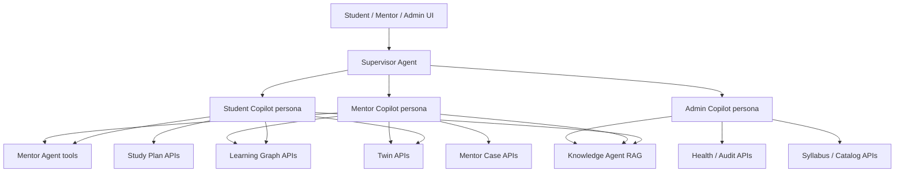

# Sprint R0.0 — AI Readiness Assessment (RAG Readiness Report)

**Date:** 2026-06-18  
**Sprint:** R0.0 — AI Readiness Assessment  
**Scope:** Architecture, readiness analysis, effort estimates, and recommended roadmap only  

**Explicit non-goals (this sprint):** No agents, no RAG implementation, no new APIs, no LLM integration, no vector database integration.

**Related documents:**

- [MASTER_IMPLEMENTATION_PLAN.md](./MASTER_IMPLEMENTATION_PLAN.md) — Phase P7 (Knowledge & Current Affairs)
- [05-agent-architecture.md](./05-agent-architecture.md) — Supervisor + multi-agent design
- [06-api-spec.md](./06-api-spec.md) — Target `knowledge_chunks`, hybrid search, `POST /knowledge/ask`
- [MENTOR_AGENT_SPECIFICATION.md](./MENTOR_AGENT_SPECIFICATION.md) — Mentor vs Knowledge Agent boundary
- [PYQ_INTELLIGENCE_SPECIFICATION.md](./PYQ_INTELLIGENCE_SPECIFICATION.md) — PYQ catalog (spec; not fully implemented)
- [P1_1C_IMPLEMENTATION_REPORT.md](./P1_1C_IMPLEMENTATION_REPORT.md) — Pilot platform readiness (~89/100)

---

## Executive Summary

PrepOS has a **mature deterministic intelligence layer** (Learning Graph, Preparation Twin, Study Plan, Goals, Mentor Cases, Syllabus catalog) but **zero RAG infrastructure** today: no pgvector extension, no embedding pipeline, no `knowledge_chunks` table, no LLM client, and no semantic search beyond SQL `ILIKE` on concept names.

| Dimension | Score (0–100) | Notes |
|-----------|---------------|-------|
| **Platform pilot readiness** | ~89 | Post P1.1C: CI, E2E, ops health, deployment |
| **AI / RAG readiness** | **~22** | Rich structured state; almost no embeddable corpora ingested |
| **Copilot readiness (design)** | ~35 | Agent specs exist; no runtime, tools, or chat surface |
| **External knowledge readiness** | **~5** | NCERT/PYQ/CA content not licensed or ingested |

**Bottom line:** The platform is an excellent **context assembly** foundation for copilots (Twin + LG + deterministic explanations), but **retrieval-augmented answers** require Phase P7 work: content acquisition, ingestion pipeline, pgvector schema, hybrid search, eval gates, and agent runtime. Student-facing “Explain federalism” cannot be grounded in platform data alone until external corpora exist.

**Recommended sequencing:** Complete P7 S15–S17 (ingestion → hybrid search → CA) **after** pilot retention is proven and **before** exposing chat broadly. Use deterministic Twin/LG APIs for copilot v0 (“why is my readiness low?”) without RAG.

---

## 1. Existing Knowledge Sources Audit

### 1.1 Summary matrix

| Source | Primary storage | Scope | Text richness | RAG-ready today? | Primary access |
|--------|-----------------|-------|---------------|------------------|----------------|
| Learning Graph | `student_concept_progress`, `learning_graph_events` | Per-student | Low (numeric + enums) | No — use tools, not chunks | `GET /learning-graph/*` |
| Digital Twin | `preparation_twins` (+ `twin_payload` JSONB) | Per-student | Medium (templated explanations) | Partial — context injection | `GET /twin/*` |
| Forecasts | Sections inside `twin_payload` | Per-student | Medium (deterministic strings) | No standalone corpus | Via Twin snapshot |
| Goals | `student_preparation_goals` | Per-student | Low (targets + dates) | No | `GET/POST/PUT /goals` |
| Study Plans | `student_study_plans` | Per-student | Medium (`adjustment_explanation`) | Context injection only | `GET /study-plan` |
| Mentor Cases | `mentor_cases`, `mentor_case_notes` | Per-student / tenant | Mixed (notes = free text) | Notes only (tenant-scoped) | `GET /mentor/*` |
| Syllabus | `exams`, `subjects`, `topics`, `concepts`, `concept_relationships` | Platform-global | Low–medium (names + metadata) | Keyword search only | `GET /syllabus/*`, `GET /concepts/search` |
| PYQ data | `concepts.pyq_count`, `importance` (+ spec: `pyq_questions`) | Catalog + per-student importance | **No question text in DB** | Not until PYQ engine ships | Spec tools only |

---

### 1.2 Learning Graph

**Purpose:** Authoritative per-student knowledge state (mastery, retention, confidence, importance, node lifecycle).

**Storage:**

| Table | Role |
|-------|------|
| `student_concept_progress` | One row per `(tenant, student, concept)` — ~618 nodes for UPSC CSE catalog |
| `learning_graph_events` | Append-only event log with `event_payload` JSONB |
| `score_audit_log` | Score change audit trail |

**Key fields (structured):** `mastery_score`, `retention_score`, `confidence_score`, `importance_score`, `node_state`, attempt counts, scoring version strings.

**Text / unstructured:** Minimal. `event_payload` may contain activity metadata; no long-form content.

**APIs:** Overview, summary, readiness, weaknesses, concept node detail, activity recording (`/learning-graph`).

**Caching:** Redis-backed summary cache (`RedisLearningGraphCache`, TTL ~300s) — not used for semantic retrieval.

**RAG implication:** Learning Graph is **not an embedding corpus**. It is the **ground truth for tool calls** and copilot context (JSON snippets). Retrieval should filter/boost chunks by weak/high-importance `concept_id`s, not embed score rows.

---

### 1.3 Digital Twin (Preparation Twin)

**Purpose:** Denormalized student intelligence profile — readiness, recommendations, forecast, mentor signals.

**Storage:**

| Artifact | Location |
|----------|----------|
| Scalar projections | `preparation_twins` columns (`readiness_score`, `due_revision_count`, `top_mentor_message`, …) |
| Rich profile | `twin_payload` JSONB (merged sections) |
| Recommendations | `preparation_twin_recommendations` |

**`twin_payload` sections (observed in code):** `readiness`, `drivers`, `recommendations`, `revision_queue`, `study_plan`, `study_behavior`, `goal`, `forecast`, `predicted_outcome`, `simulations`, `trajectory`, `milestones`, `milestone_status`, `forecast_probability`, `forecast_scenarios`, `score_distribution`, `decision`, `intervention*`, `optimization`, `behavior_profile`, `personalization`, `mentor`.

**Text fields:** Deterministic template strings in `explanation` keys (e.g. forecast, milestone status, interventions). Example from `forecast_explanations_v1.py`: *"You currently have a {probability}% likelihood of reaching your goal."* — not LLM-generated.

**Design invariant:** `build_twin_payload_v1` explicitly states: *"Deterministic Twin profile payload; no LLM or free-text generation."*

**APIs:** `/twin/recommendations`, `/twin/snapshot`, `/twin/dashboard`, projection metrics.

**RAG implication:** Twin explanations are **high-trust copilot context** (inject via tools). Embedding twin JSON per student would be stale, redundant, and tenant-sensitive — **avoid chunking twin payloads for vector search**. Instead, copilots read live Twin APIs with cache invalidation on `TwinUpdated`.

---

### 1.4 Forecasts

**Purpose:** Goal attainment probability, projected readiness, trajectory, predicted exam score bands.

**Storage:** Computed into `twin_payload` sections (`forecast`, `forecast_probability`, `predicted_outcome`, `trajectory`, `simulations`) during Twin rebuild — **no dedicated `/forecast` API or table**.

**Text:** Short deterministic explanations from scoring domain modules (`forecast_explanations_v1`, `readiness_explanation_v1`, etc.).

**RAG implication:** Forecasts answer *"Am I on track?"* via structured tools. They do not benefit from semantic retrieval unless paired with external study content recommendations.

---

### 1.5 Goals

**Purpose:** Student target readiness score, target date, daily capacity.

**Storage:** `student_preparation_goals` — `(target_readiness_score`, `target_date`, `daily_capacity_minutes)`.

**Derived data:** Milestones and milestone status explanations are **computed on read/rebuild** into Twin payload, not stored as separate documents.

**APIs:** `GET/POST/PUT /goals`.

**RAG implication:** Structured only. Copilot uses goal + forecast tools for planning questions; no embedding value.

---

### 1.6 Study Plans

**Purpose:** Daily/weekly prioritized study items with estimated readiness gain.

**Storage:** `student_study_plans` — `daily_plan_json`, `weekly_plan_json` (JSONB arrays), `total_estimated_gain`.

**Plan item shape (structured):** `concept_id`, `activity_type`, `priority`, `estimated_minutes`, `estimated_gain`, `adjustment_explanation` (deterministic string from `plan_adjustment_explanations_v1`).

**APIs:** Study plan read/generate endpoints under `/study-plan`.

**RAG implication:** Plans tell copilots *what* to study; Knowledge RAG tells *how to explain* a concept. Link via `concept_id` metadata on chunks, not by embedding plan rows.

---

### 1.7 Mentor Cases

**Purpose:** Faculty workflow — escalations, case queue, resolution tracking.

**Storage:**

| Table | Content |
|-------|---------|
| `mentor_cases` | Structured enums: `status`, `priority`, `mentor_action_type`, `escalation_level`, timestamps |
| `mentor_case_notes` | **Free-text** `note` (Text column) — primary unstructured tenant artifact |
| `mentor_action_effectiveness` | Aggregate effectiveness metrics per action type |

**Twin linkage:** `preparation_twins.top_mentor_message`, `mentor_action_type`, case status columns mirror active mentor state.

**APIs:** Mentor queue, case detail, notes CRUD, resolve (`/mentor`).

**RAG implication:** Mentor notes are **retrieval candidates** for Mentor Copilot (tenant-scoped, student-scoped metadata). Requires strict RBAC and PII handling. Not suitable for cross-tenant embedding index without isolation (separate partition or `tenant_id` filter on every query).

---

### 1.8 Syllabus (Exam Domain Catalog)

**Purpose:** Platform-global UPSC CSE concept taxonomy — the spine for LG, PYQ mapping, and content linking.

**Storage:** `exams`, `exam_tracks`, `subjects`, `topics`, `concepts`, `concept_relationships`, `catalog_versions`.

**Seed corpus:** `seeds/upsc_cse_concepts_v1_0.json` (~17.7k lines) — **618 concepts**, 18 subjects, exam tracks; loaded into Postgres on seed/migrate.

**Concept fields:** `concept_name`, slugs, relevance scores (prelims/mains/interview), `difficulty`, `importance`, `pyq_count`, `pyq_mappable`, `tags[]`, `metadata_json` JSONB, hierarchy via `parent_concept_id`.

**Search today:** `ConceptRepository.search_concepts` — SQL `ILIKE` on `concept_name`, `concept_id`, `concept_slug` (no full-text index, no vectors).

**APIs:** `/syllabus/tree`, `/concepts/search`, concept detail.

**RAG implication:** Syllabus is the **metadata backbone** for chunk linking (`concept_ids[]` in chunk metadata). Optional: embed **synthetic concept cards** (name + subject + topic + tags + difficulty) to improve “find related concept” — small corpus (~618 chunks), cheap to maintain on catalog version bump.

---

### 1.9 PYQ Data

**Specified (PYQ_INTELLIGENCE_SPECIFICATION.md):** `pyq_questions`, `pyq_mappings`, faculty weights, Importance engine, ingestion/quarantine, `GetPYQInsightsTool`.

**Implemented today:**

| Capability | Status |
|------------|--------|
| `concepts.pyq_count`, `importance` columns | Present (often zero until engine runs) |
| `RecordPyqChange` LG activity API | Present |
| `pyq_questions` table / question text | **Not implemented** |
| PYQ ingestion pipeline | **Not implemented** |
| `GetPYQInsightsTool` | Spec only |

**RAG implication:** PYQ **question stems and explanations** are high-value embedding candidates (spec defers PYQ text → RAG to V2 with licensing boundary). Until PYQ engine + licensed corpus exist, copilots cannot answer *"Show me PYQs on Article 356"* from platform data.

---

### 1.10 Additional latent sources (not in original list, relevant to RAG)

| Source | Storage | Notes |
|--------|---------|-------|
| **Outbox events** | `outbox_events.payload` JSONB | Rich event stream; future **analytics / audit** index, not student Q&A |
| **Audit logs** | `audit_logs.metadata_json` | Admin copilot ops context |
| **Student profile** | `students` onboarding fields | Structured; copilot personalization |
| **Revision queue** | `revision_queue` tables | Structured scheduling state |
| **Planned external corpora** | S3 (not wired) | NCERT, Laxmikanth, Spectrum, PIB, PRS, Economic Survey per architecture docs |

---

## 2. Source Classification

### 2.1 Structured sources (deterministic, tool-friendly)

Best accessed via **API/tools**, not vector search:

- `student_concept_progress` (all score dimensions)
- `preparation_twins` scalars + `twin_payload` numeric sections
- `student_preparation_goals`
- `student_study_plans` plan items (except explanation strings)
- `preparation_twin_recommendations`
- `mentor_cases` (status, priority, action types)
- `mentor_action_effectiveness`
- Syllabus hierarchy and concept metadata (non-prose)
- `learning_graph_events`, `score_audit_log`, `outbox_events` (machine events)
- Health/ops metrics (`/health/ops`, worker/outbox status)

### 2.2 Unstructured / semi-structured sources (natural language)

| Source | Volume (today) | Sensitivity |
|--------|----------------|-------------|
| Mentor case notes | Low (grows with pilot) | Tenant + student PII |
| Twin/plan/forecast **explanation** strings | Medium (generated per student) | Student-specific |
| `catalog_versions.change_summary` | Very low | Platform |
| `concepts.metadata_json` | Variable | Platform |
| **Future:** book chapters, CA articles, PYQ text | **Zero ingested** | Licensing-dependent |

### 2.3 Retrieval candidates (ranked)

| Priority | Candidate | Retrieval mode | Rationale |
|----------|-----------|----------------|-----------|
| P0 | Licensed book/NCERT chunks | Hybrid vector + keyword | Core “explain concept” use case |
| P0 | PYQ question text (post-engine) | Hybrid + concept filter | UPSC-specific; names/years need keyword leg |
| P1 | Syllabus concept cards | Vector (+ exact ID lookup) | Disambiguation, related concepts |
| P1 | Current Affairs items (P7) | Hybrid + date filter | Time-sensitive queries |
| P2 | Mentor case notes | Vector, tenant-scoped | Mentor copilot continuity |
| P2 | Institute-uploaded notes | Vector, tenant-scoped | B2B differentiator |
| P3 | Deterministic Twin explanations | **Tool injection, not RAG** | Already authoritative |
| P3 | Learning Graph rows | **SQL/tools** | Numeric state |
| P4 | Outbox/audit streams | Keyword/time index | Admin copilot only |

### 2.4 Embedding candidates

**Embed (chunk → vector):**

- External document chunks (500–800 tokens, 100 overlap per `06-api-spec.md`)
- PYQ stems + official explanations (when licensed)
- CA article body + summary
- Synthetic syllabus concept cards (200–400 tokens each)
- Optional: mentor notes (with redaction pipeline)

**Do not embed (use structured retrieval instead):**

- Raw `student_concept_progress` rows
- Full `twin_payload` blobs
- Study plan JSON as documents
- JWT/session data, audit secrets

**Metadata to store alongside every chunk (for filtering):**

```json
{
  "exam_id": "upsc_cse",
  "tenant_id": null,
  "source_type": "ncert|pyq|current_affairs|syllabus_card|institute_notes",
  "source_id": "uuid",
  "concept_ids": ["upsc_cse.polity.fundamental_rights"],
  "subject_id": "upsc_cse.polity",
  "topic_id": "...",
  "catalog_version": "1.0.0",
  "language": "en",
  "published_at": "2026-01-15",
  "chunk_index": 3,
  "license_tag": "licensed|internal|user_upload"
}
```

---

## 3. Proposed Architecture (Design Only)

### 3.1 pgvector schema (recommended)

Align with `06-api-spec.md` and `MASTER_IMPLEMENTATION_PLAN.md`, with adjustments for **model dimension flexibility** (Risk R7 / Decision D7).

#### Extension

```sql
CREATE EXTENSION IF NOT EXISTS vector;
CREATE EXTENSION IF NOT EXISTS pg_trgm;  -- already used for concept_name index hint
```

#### Tables

**`knowledge_sources`** — provenance for ingested documents

| Column | Type | Notes |
|--------|------|-------|
| `id` | UUID PK | |
| `tenant_id` | UUID NULL | NULL = platform-global |
| `exam_id` | VARCHAR(64) FK | Required for UPSC scoping |
| `source_type` | VARCHAR(64) | `ncert`, `pyq`, `current_affairs`, … |
| `title` | TEXT | |
| `external_uri` | TEXT | S3 key or source URL |
| `content_hash` | VARCHAR(64) | Dedup / re-ingest detection |
| `catalog_version` | VARCHAR(32) | Syllabus link version |
| `status` | VARCHAR(32) | `draft`, `active`, `archived`, `quarantined` |
| `metadata_json` | JSONB | License, author, year |
| `created_at` / `updated_at` | TIMESTAMPTZ | |

**`knowledge_chunks`** — retrieval unit

| Column | Type | Notes |
|--------|------|-------|
| `id` | UUID PK | |
| `source_id` | UUID FK → `knowledge_sources` | |
| `chunk_index` | INT | Order within source |
| `content` | TEXT NOT NULL | Chunk text |
| `content_tsv` | TSVECTOR GENERATED | Full-text leg (hybrid search) |
| `token_count` | INT | Billing / debugging |
| `metadata_json` | JSONB | `concept_ids`, subject, tags |
| `embedding_model` | VARCHAR(64) | e.g. `text-embedding-3-large` |
| `embedding_dims` | INT | e.g. 3072 |
| `embedding` | VECTOR(3072) | Or use separate table below |
| `created_at` | TIMESTAMPTZ | |

**Alternative (recommended for provider flexibility):** `knowledge_chunk_embeddings` with `(chunk_id, model, dims, embedding)` so re-embedding does not duplicate content rows.

**Indexes:**

```sql
CREATE INDEX ix_knowledge_chunks_source ON knowledge_chunks(source_id, chunk_index);
CREATE INDEX ix_knowledge_chunks_metadata ON knowledge_chunks USING GIN (metadata_json);
CREATE INDEX ix_knowledge_chunks_fts ON knowledge_chunks USING GIN (content_tsv);
CREATE INDEX ix_knowledge_chunks_embedding ON knowledge_chunks
  USING hnsw (embedding vector_cosine_ops) WITH (m = 16, ef_construction = 64);
```

**Tenant isolation:** Platform-global content (`tenant_id IS NULL`) + optional institute overlays (`tenant_id` set). Every query MUST filter: `(tenant_id IS NULL OR tenant_id = :tenant)`.

**Student-private data:** Do **not** store student LG/Twin in `knowledge_chunks`. Keep in Postgres row stores; copilots fetch via tools.

#### Migration placement

New Alembic migration in Phase P7 S15, after content licensing sign-off (Gap G8 / Decision D12).

---

### 3.2 Embedding strategy

| Decision | Recommendation | Tradeoff |
|----------|----------------|----------|
| **Primary model** | OpenAI `text-embedding-3-large` (3072 dims) — matches existing docs | Cost vs quality; locks dimension unless abstracted |
| **Abstraction** | `EmbeddingPort` in application layer; store `embedding_model` + `embedding_dims` per chunk | Slightly more schema complexity; enables model migration |
| **Batching** | Celery `knowledge` queue; batch 100–500 chunks per API call | Throughput vs rate limits |
| **Re-embed triggers** | New `catalog_version`, source `content_hash` change, model upgrade job | Background cost; must version indexes |
| **Caching** | Redis cache query embedding for repeated questions (TTL 1h) | Saves cost; stale if student context irrelevant |
| **Hybrid query** | Embed query + tsvector `plainto_tsquery` + RRF fusion | UPSC queries need act names, years, report titles |
| **Concept-aware boost** | Post-filter or score boost using `concept_ids` from LG weak nodes | Requires copilot to pass `concept_id` hints |

**Non-English / Hindi content:** Defer until corpus requires; store `language` in metadata for filtered retrieval.

**Cost control (from Part 5):** Embed catalog once; embed student uploads per tenant; cap institute upload volume by plan tier.

---

### 3.3 Chunking strategy

| Corpus type | Strategy | Target size | Overlap | Notes |
|-------------|----------|-------------|---------|-------|
| **Textbooks / PDFs** | Semantic + heading-aware split | 500–800 tokens | 100 tokens | Per `06-api-spec.md`; preserve chapter/section in metadata |
| **PYQ** | 1 chunk = 1 question (+ options + explanation) | Variable | 0 | Link `concept_ids` from mapping engine |
| **Current Affairs** | 1 chunk = article summary + key bullets | 300–600 tokens | 50 | Store `published_at` for recency ranking |
| **Syllabus concept cards** | 1 chunk = 1 concept synthetic doc | 150–350 tokens | 0 | Regenerate on catalog publish |
| **Mentor notes** | 1 chunk = note or thread segment | ≤512 tokens | 0 | Tenant-scoped; optional PII scrub step |
| **Twin/plan explanations** | **Do not chunk** | — | — | Inject live via tools |

**Extraction pipeline (P7 S15):** Upload → S3 → extract (PDF/DOCX/HTML) → normalize → chunk → validate token count → embed → store → index FTS → emit `KnowledgeSourceIngested` event.

**Quality gates:** Quarantine chunks failing min length, encoding errors, or missing `exam_id`; mirror PYQ quarantine pattern from spec.

---

### 3.4 Retrieval API design (proposed — not implemented)

Existing spec reference: `POST /knowledge/ask` (`06-api-spec.md`). Expand into a small **Knowledge module** API surface for P7.

#### Endpoints (future)

| Method | Path | Purpose | Auth |
|--------|------|---------|------|
| `POST` | `/knowledge/search` | Retrieval-only (no LLM) — returns ranked chunks + scores | Student+ |
| `POST` | `/knowledge/ask` | RAG answer with citations (Knowledge Agent) | Student+ |
| `GET` | `/knowledge/sources` | List ingested sources (admin/faculty) | Faculty/Admin |
| `POST` | `/knowledge/sources` | Trigger ingestion (admin) | Admin |
| `GET` | `/knowledge/sources/{id}/status` | Ingestion job status | Admin |
| `WS` | `/ws` | Stream tokens (`type: token`) per existing WebSocket spec | Student+ |

#### `POST /knowledge/search` (retrieval contract)

**Request:**

```json
{
  "query": "Explain basic structure doctrine and Kesavananda Bharati",
  "exam_id": "upsc_cse",
  "concept_ids": ["upsc_cse.polity.basic_structure"],
  "source_types": ["ncert", "pyq"],
  "limit": 8,
  "hybrid_alpha": 0.7
}
```

**Response:**

```json
{
  "chunks": [
    {
      "chunk_id": "uuid",
      "content": "...",
      "score": 0.82,
      "vector_score": 0.79,
      "keyword_score": 0.91,
      "source": { "source_id": "uuid", "title": "Laxmikanth Ch. 7", "source_type": "book" },
      "metadata": { "concept_ids": ["..."], "page": 142 }
    }
  ],
  "query_embedding_model": "text-embedding-3-large"
}
```

#### `POST /knowledge/ask` (RAG contract)

**Request:** Same as search + optional `conversation_id`, `include_student_context: true`.

**Flow:**

1. Auth + rate limit + tenant scope  
2. Optional: fetch LG/Twin weak concepts for query expansion  
3. Hybrid retrieval (top-k=8, rerank top-4)  
4. Knowledge Agent: grounded generation with **mandatory citations** `[chunk_id]`  
5. Eval hook: log faithfulness score; block if below threshold (Decision D5)  
6. Audit: `audit_logs` + AI decision metadata  

**Response:**

```json
{
  "answer": "...",
  "citations": [{ "chunk_id": "uuid", " excerpt": "..." }],
  "related_concepts": [{ "concept_id": "...", "concept_name": "..." }],
  "confidence": "high|medium|low",
  "request_id": "..."
}
```

#### Internal service layer (Clean Architecture)

```
api/v1/knowledge/router.py
  → application/knowledge/search_service.py
  → application/knowledge/rag_service.py
  → domain/knowledge/retrieval_policy.py
  → infrastructure/knowledge/pgvector_repository.py
  → infrastructure/knowledge/embedding_client.py
  → infrastructure/knowledge/fulltext_repository.py
```

**Dependency rule:** Domain defines `Chunk`, `RetrievalQuery`, `Citation` — no OpenAI imports in domain.

---

## 4. Copilot Designs (Architecture Only)

Copilots are **UX personas** routed by the **Supervisor Agent** (`05-agent-architecture.md`). They compose **deterministic tools** + **optional RAG** + **LLM phrasing** with strict boundaries from `MENTOR_AGENT_SPECIFICATION.md`.

### 4.1 Shared architecture



**Shared principles:**

1. **LLM never invents scores** — all numbers from tools (Mentor spec §2).  
2. **Supervisor routes intent** — planning → Mentor; concept explanation → Knowledge; ops → Admin tools.  
3. **RAG is optional layer** — v0 copilots can ship with tools-only for pilot.  
4. **Memory:** M1 session (10 turns), M4 plan snapshot hash; no unbounded chat log in V1.  
5. **Streaming:** WebSocket token events for interactive chat.  
6. **Eval gates:** No broad student chat until hallucination rate < agreed threshold.

---

### 4.2 Student Copilot

**Persona:** Personal UPSC preparation assistant — explains *your* state and *syllabus content* without replacing Mentor planning authority.

| Intent bucket | Router | Tools / retrieval |
|---------------|--------|-------------------|
| "What should I study today?" | Mentor Agent | Twin recommendations, study plan, revision queue |
| "Why is my readiness low?" | Student Copilot | Twin drivers, LG weaknesses, forecast explanation (tools) |
| "Explain federalism / Article 356" | Knowledge Agent | RAG over NCERT/books/PYQ + concept filter |
| "Am I on track for June 2027?" | Twin + Goals | Forecast, milestones, goal API |
| "What does this recommendation mean?" | Twin | Recommendation row + concept label lookup |

**Context assembly order:**

1. Student profile (exam, target year, capacity)  
2. Twin snapshot (readiness, top 3 recommendations, forecast one-liner)  
3. LG summary (weakest 5 concepts by readiness impact)  
4. RAG chunks (only for content-explanation intents)  
5. System prompt: cite sources; refuse if chunks insufficient  

**Safety:** No other students’ data; no faculty override actions; rate limit per student.

**v0 without RAG:** Answer state/planning questions fully; defer content explanation to linked syllabus concept pages.

---

### 4.3 Mentor Copilot

**Persona:** Faculty force multiplier — case triage, student context, coaching suggestions; **does not** replace case resolution workflow.

| Intent bucket | Tools |
|---------------|-------|
| "Summarize this student's situation" | Twin dashboard, LG overview, goal, recent activity |
| "Why was this case escalated?" | Mentor case + Twin mentor section + `top_mentor_message` |
| "Draft coaching note" | LLM phrasing constrained to tool outputs; mentor edits before save |
| "Similar past cases" | Vector search on **tenant-scoped** mentor notes (optional P2) |
| "PYQ gaps for this student" | Future `GetPYQInsightsTool` |

**Boundary (spec §10.4):** Deep CA/content explanation → route to Knowledge Agent; Mentor Copilot assigns *what*, not long-form *why* from hallucination-prone generation.

**Writes allowed:** Case notes, case resolution (existing APIs) — copilot proposes, human confirms.

**Context:** Queue position, case priority, student pseudonymization in logs.

---

### 4.4 Admin Copilot

**Persona:** Platform operator — catalog health, ingestion status, worker/outbox health, tenant onboarding diagnostics.

| Intent bucket | Tools |
|---------------|-------|
| "Is the platform healthy?" | `/health/ops`, worker/outbox endpoints (P1.1C) |
| "Catalog coverage gaps" | Syllabus stats, concepts with `pyq_count=0`, unmapped PYQ flags |
| "Ingestion failures" | Knowledge source job status (P7) |
| "Tenant activity summary" | Audit logs, aggregate metrics (limited today) |

**No student PII** unless admin role + explicit student lookup tool with audit.

**RAG role:** Search **platform runbooks** (`docs/PILOT_RUNBOOK.md`, ops guides) ingested as internal `source_type=runbook` — low priority P3.

**v0 without RAG:** Structured ops dashboard (`/admin/health`) + scripted FAQ.

---

### 4.5 Agent runtime (future module map)

| Component | Location (proposed) | Phase |
|-----------|---------------------|-------|
| Supervisor | `application/agents/supervisor/` | P7–P8 |
| Tool gateway | `application/agents/tools/` | P7 |
| Prompt registry | `prompts/knowledge/`, `prompts/mentor/` (versioned) | P7 |
| Knowledge Agent | `application/agents/knowledge/` | P7 S16 |
| Chat session store | Redis or Postgres `agent_sessions` | P7 |
| Eval harness | `tests/eval/knowledge/` | P7 S16 gate |

---

## 5. Gap Analysis & Risks

| Gap | Impact | Mitigation |
|-----|--------|------------|
| No pgvector / chunks table | Blocks all RAG | P7 S15 migration |
| No external corpora / licensing (G8, D12) | Nothing to retrieve | Legal + acquisition plan before ingest |
| PYQ engine not built | No PYQ-grounded answers | Implement PYQ spec first or parallel track |
| No LLM client / agent runtime | No `/knowledge/ask` | Provider gateway (D6) + Supervisor |
| Concept search = ILIKE only | Poor lexical recall | Add tsvector on concepts + hybrid |
| Twin/LG not embeddable | Misguided RAG scope | Document tool-first pattern (this report) |
| No eval harness (D5) | Hallucination risk | S16 gate before student chat |
| WebSocket streaming not implemented | Poor chat UX | P7 frontend + `/ws` |
| Embedding dim hard-coded in docs (3072) | Provider lock-in | Store model+dim per chunk (D7) |

**Strengths to leverage:**

- Event-driven architecture (`outbox_events`) for async indexing  
- Clean Architecture + repository pattern — Knowledge module fits modular monolith  
- Deterministic explanations already build user trust — copilot should **surface** them, not replace  
- 618-concept catalog with LG linkage — strong metadata graph for filtered RAG  
- Mentor case notes — unique institute IP for B2B copilot moat  

---

## 6. Effort Estimates

Estimates assume 1 backend + 0.5 AI/ML + 0.5 frontend engineer per sprint (2 weeks), aligned with `MASTER_IMPLEMENTATION_PLAN.md` P7.

| Workstream | Sprint | Effort (person-weeks) | Deliverable |
|------------|--------|----------------------|-------------|
| **R0.0** Assessment (this doc) | — | 1 | Readiness report ✅ |
| Content licensing & sample corpus | Pre-S15 | 2–4 (legal parallel) | 1 exam-worth licensed PDFs |
| pgvector schema + migration | S15 | 2 | Tables, indexes, repos |
| Ingestion pipeline (S3, extract, chunk) | S15 | 3 | End-to-end ingest job |
| Embedding worker + Celery queue | S15 | 2 | Batch embed + idempotent re-run |
| Syllabus concept card generator | S15 | 1 | 618 embedded cards |
| Hybrid search service | S16 | 3 | Vector + FTS + RRF |
| Knowledge Agent + `/knowledge/ask` | S16 | 3 | Grounded Q&A + citations |
| Eval harness + hallucination gate | S16 | 2 | Block release if threshold fail |
| Student Copilot UI + `/ws` | S16–S17 | 3 | Chat panel, streaming |
| Mentor Copilot (tools-only v1) | S17 | 2 | Case + twin context chat |
| Admin Copilot (ops tools) | S17 | 1 | Health + catalog queries |
| PYQ engine + PYQ chunk ingest | Parallel P6/P7 | 6–8 | `pyq_questions` + mappings |
| Current Affairs module | S17 | 4 | CA ingest + concept linking |

**Total (RAG + copilot MVP):** ~**24–32 person-weeks** (~12–16 calendar weeks with parallel work).

**Copilot v0 (tools-only, no RAG):** ~**6–8 person-weeks** — Supervisor stub, Mentor tools wired, Student state Q&A, no `/knowledge/ask`.

---

## 7. Recommended Roadmap

### Phase 0 — Now (post R0.0, pre-RAG)

| Step | Action | Owner |
|------|--------|-------|
| 0.1 | Founder sign-off on content licensing (D12) | Legal / Product |
| 0.2 | Decide embedding provider + dimension policy (D6, D7) | AI lead |
| 0.3 | Define eval thresholds for Knowledge Agent (D5) | AI + Product |
| 0.4 | Pilot copilot **FAQ** using existing Twin/LG APIs (no LLM) | Frontend |

### Phase 1 — P7 S15: Ingestion foundation

- Enable pgvector; create `knowledge_sources` + `knowledge_chunks`  
- Ship ingestion pipeline with **one** licensed corpus (e.g. NCERT Polity sample)  
- Embed syllabus concept cards  
- Internal `POST /knowledge/search` (retrieval-only, staff-only flag)  

**Exit criteria:** Staff can search ingested chunks by concept_id with hybrid scores.

### Phase 2 — P7 S16: Knowledge Agent + Student Copilot

- `POST /knowledge/ask` with citations  
- Eval harness passes on golden UPSC Q&A set  
- Student Copilot chat (Supervisor → Knowledge/Mentor routing)  
- WebSocket streaming  

**Exit criteria:** Hallucination rate below agreed threshold; 20 golden questions grounded.

### Phase 3 — P7 S17: Mentor + Admin copilots + CA

- Mentor Copilot (case queue + twin tools)  
- Admin Copilot (ops + catalog health)  
- Current Affairs ingestion + linking  
- Optional tenant note upload (institute RAG)  

**Exit criteria:** Mentor pilot uses copilot for case summarization; CA items retrievable by date + concept.

### Phase 4 — PYQ + scale (P6/P7 overlap)

- Implement PYQ Intelligence spec  
- Ingest licensed PYQ text into chunks  
- `GetPYQInsightsTool` for Mentor Agent  

**Exit criteria:** "Show PYQs on topic X" returns licensed question text with citations.

---

## 8. AI Readiness Scorecard (R0.0)

| Category | Score | Evidence |
|----------|-------|----------|
| Structured student state | **90** | LG + Twin + plans + goals production-ready |
| Syllabus catalog | **75** | 618 concepts seeded; ILIKE search only |
| Unstructured corpora | **5** | No ingested documents |
| Vector / semantic infra | **0** | No pgvector, no embeddings in codebase |
| Agent runtime | **10** | Specs only (`05-agent-architecture`, Mentor spec) |
| Retrieval API | **5** | Documented in `06-api-spec`; not implemented |
| Copilot UX | **15** | No chat UI; dashboards exist |
| Eval / safety | **20** | Audit logs, RBAC; no RAG eval |
| Content licensing | **0** | Decision D12 open |
| **Overall AI/RAG readiness** | **~22 / 100** | Tool-first copilot viable; RAG not |

**Interpretation:** PrepOS can ship a **deterministic copilot v0** using Twin/LG/plan APIs immediately (~6–8 weeks). **Trustworthy content RAG** requires P7 + licensed data (~3–4 months after content acquisition starts).

---

## 9. Decisions Required Before Implementation

| ID | Decision | Options | Recommendation |
|----|----------|---------|----------------|
| D6 | LLM provider strategy | OpenAI-only vs multi-provider gateway | Provider-agnostic gateway interface |
| D7 | Embedding model + dimensions | 3072 large vs 1536 small vs open source | Config-driven; default `text-embedding-3-large` |
| D12 | Content licensing | Owned vs licensed vs user-upload only | Start with licensed NCERT + institute uploads |
| D5 | RAG eval threshold | % faithful citations / human rubric | Block student `/knowledge/ask` until pass |
| NEW | Copilot v0 scope | Tools-only vs wait for RAG | Ship tools-only Student Q&A in pilot+1 |
| NEW | Tenant note RAG | Platform-only vs institute overlays | Both; strict `tenant_id` partition |

---

## 10. Appendix: Key code references

| Area | Path |
|------|------|
| LG models | `backend/src/prepos/infrastructure/db/models/learning_graph.py` |
| Twin model + payload | `backend/src/prepos/infrastructure/db/models/student.py`, `domain/twin/twin_payload_v1.py` |
| Study plan | `backend/src/prepos/infrastructure/db/models/study_plan.py` |
| Goals | `backend/src/prepos/infrastructure/db/models/goal.py` |
| Mentor cases | `backend/src/prepos/infrastructure/db/models/mentor_case.py` |
| Syllabus | `backend/src/prepos/infrastructure/db/models/exam.py` |
| Concept search (ILIKE) | `backend/src/prepos/infrastructure/db/repositories/exam_repository.py` |
| Syllabus seed | `seeds/upsc_cse_concepts_v1_0.json` (618 concepts) |
| Outbox events | `backend/src/prepos/infrastructure/db/models/foundation.py` |
| LG Redis cache | `backend/src/prepos/infrastructure/cache/learning_graph_cache.py` |
| API routers | `backend/src/prepos/api/v1/{learning_graph,twin,goals,study_plan,mentor,syllabus,concepts}/router.py` |

---

## 11. Conclusion

PrepOS’s moat is **Learning Graph + Preparation Twin + deterministic engines**, not generic chat. R0.0 confirms the platform is **pilot-ready (~89/100)** for human-guided workflows but **AI/RAG-ready (~22/100)** for grounded content Q&A.

**Immediate path:** Use structured APIs for copilot v0; parallel-track content licensing and P7 ingestion. **Do not** embed student scores or twin JSON — use tools. **Do** embed licensed external corpora and link chunks to `concept_ids` from the syllabus graph.

No code, migrations, APIs, or LLM integrations were added in Sprint R0.0 — this document is the sole deliverable.

---

*End of Sprint R0.0 — AI Readiness Assessment*
